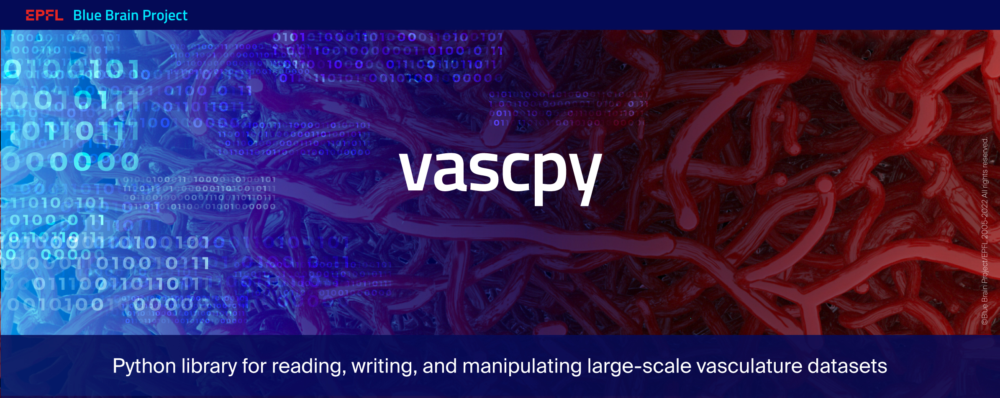

vascpy
======

`vascpy` is a python library for reading, writing, and manipulating large-scale vasculature graphs. There are two alternative graph representations available: a section-centered and an edge-centered one. It supports the following respective formats:

* H5 Morphology (see [specification](https://morphology-documentation.readthedocs.io/en/latest/h5-vasc-graph.html))
* SONATA node population of edges (see [specification](https://github.com/AllenInstitute/sonata/blob/master/docs/SONATA_DEVELOPER_GUIDE.md))

The `vascpy` library provides two classes: `PointVasculature` and `SectionVasculature` that allow for reading and writing edge-centered and section-centered datasets respectively, as well as converting between them.

Documentation
-------------
vascpy documentation is built and hosted on [readthedocs](https://readthedocs.org/).
* [latest snapshot](http://vascpy.readthedocs.org/en/latest/)

Usage
-----

Load and write an h5 morphology file:

```python
from vascpy import SectionVasculature

v = SectionVasculature.load_hdf5("sample.h5")

print(v.points)
print(v.diameters)
print(v.connectivity)
print(v.sections)

v.save_hdf5("sample2.h5")
```

Load and write an h5 SONATA file:
```python
from vascpy import PointVasculature

v = PointVasculature.load_sonata("sample_sonata.h5")

print(v.node_properties)
print(v.edge_properties)
print(v.points)
print(v.edges)
print(v.edge_types)
print(v.segment_points)
print(v.segment_diameters)
print(v.area)
print(v.volume)

v.save_sonata("sample_sonata2.h5")
```

Representation conversions
-----------

`vascpy` allows the conversion between the two representations:

```python
from vascpy import PointVasculature
point_vasculature = PointVasculature.load_hdf5("sample_sonata.h5")

section_vasculature = point_vasculature.as_section_graph()
point_vasculature = section_vasculature.as_point_graph()
```

Create and save an edge-centered vascular graph
-----------------------------------------------

```python
import numpy as np
import pandas as pd
from vascpy import PointVasculature

node_properties = DataFrame({
    'x': np.array([0., 1., 2.]),
    'y': np.array([3., 4., 5.]),
    'z': np.array([6., 7., 8.]),
    'diameter': np.array([0.1, 0.2, 0.3])
})

edge_properties = pd.DataFrame({
    'start_node': np.array([0, 0, 1]),
    'end_node': np.array([1, 2, 2]),
    'type': np.array([0, 1, 1])
})

v = PointVasculature(node_properties=node_properties, edge_properties=edge_properties)
v.save_sonata('my_vasculature.h5')
```
Funding & Acknowledgements
-------------------------

The development of this software was supported by funding to the Blue Brain Project, a research center of the École polytechnique fédérale de Lausanne (EPFL), from the Swiss government's ETH Board of the Swiss Federal Institutes of Technology.

Copyright (c) 2022 Blue Brain Project/EPFL
